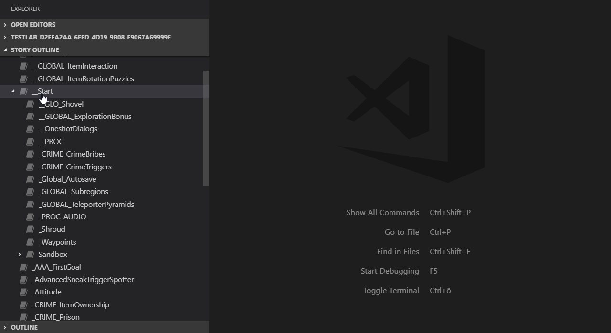
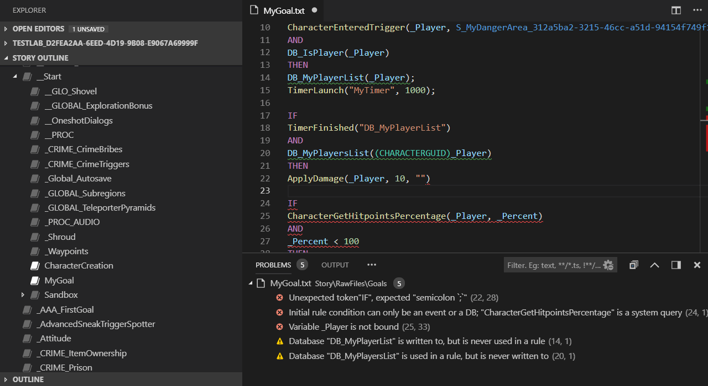
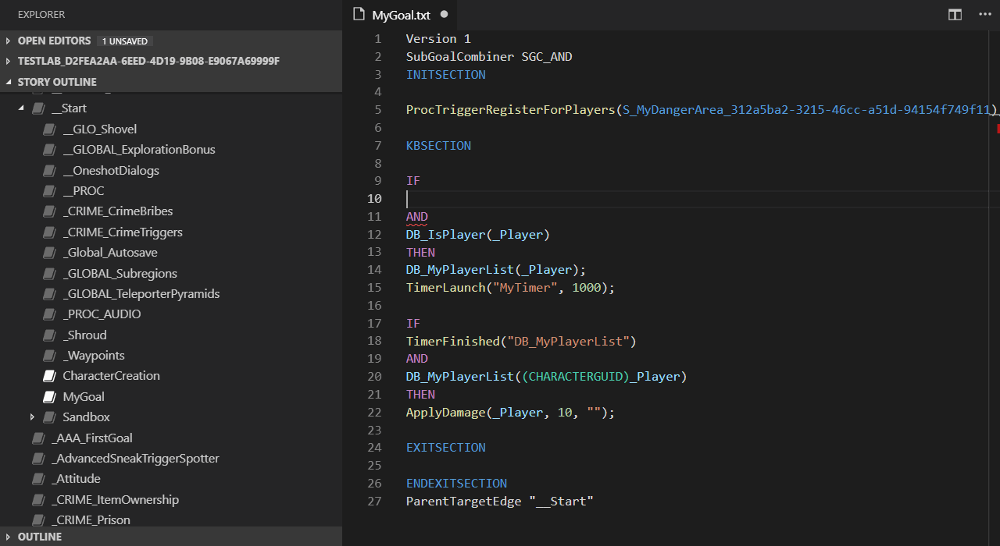
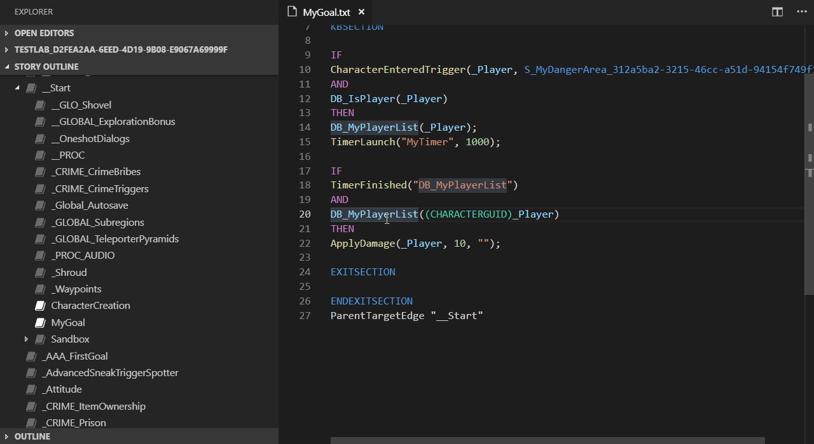
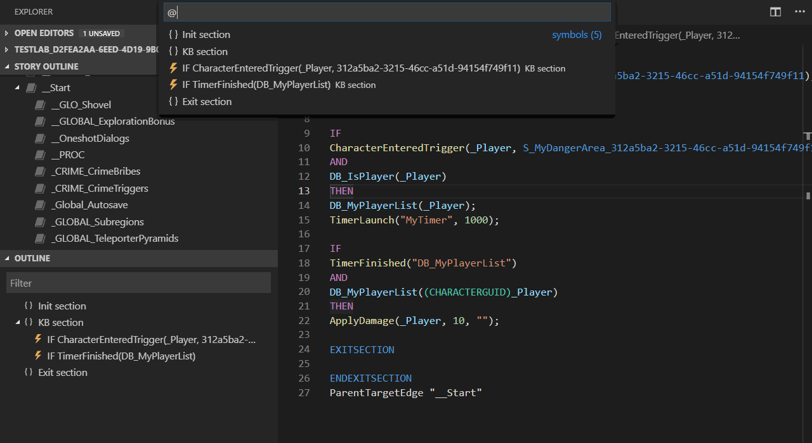
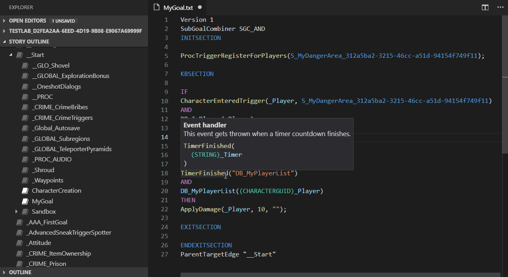
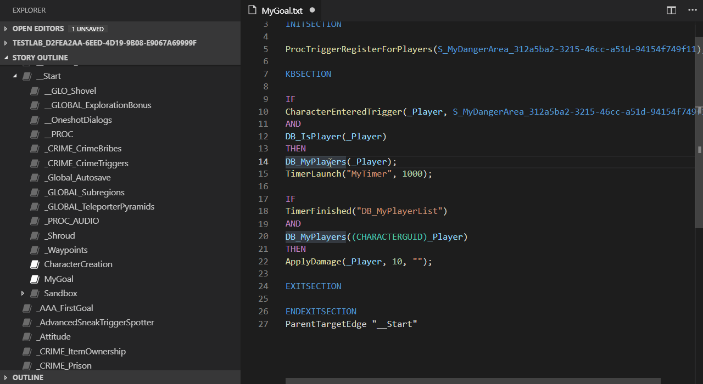
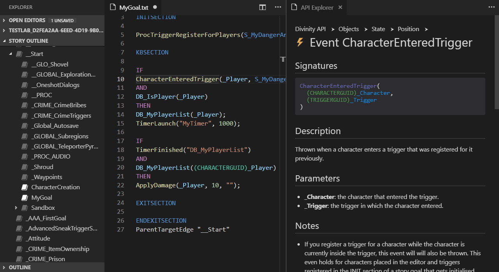

# Divinity Engine Script Support for VS Code

This extensions enables language features for the scripting language Osiris found in The Divinity Engine 2 based games.

## Getting started

### Installation

- Open the extensions tab (usually the last button in the action bar. You can lso use the shortcut Ctrl+Shift+X)
- Search for "divinity-vscode"
- On the plugin page, click the "Install", then the "Enable" button

### Open project

- Before editing a project for the first time in VS Code, make sure you have a fresh built of the project.
  - Start the Glasses editor and switch to your project.
  - Open the story editor and choose "File" > "Build".
- In VS Code, select "File" > "Open Folder..." and select the data folder of your project. The path usually looks something like this: `../Divinity Original Sin 2/Data/Mods/MyModeName_########-####-####-####-############`
- After a moment the story outline panel should show up beneath your files and you are ready to go.

## Features

### Story outline

The story outline brings you the familiar tree view from the native editor to VS Code. You can add, delete, move and rename goals using it.



### Code analysis

The extension analyzes your code while you type and immediately shows you errors and problems.



### Completion

Code completion shows you matching symbols for your current input, it will show up automatically when typing or by pressing Shift+Space. The suggestions are context sensitive and only show you the symbols that are currently available.



### Find all references and go to definition

Bring up a list of all usages of a procedure, query or database by pressing Shift+F12 or selecting the command `Find All References` from the context menu. You can also jump to the definition by pressing F12 or using the command `Go to Definition`.



### Document structure

Use the outline panel to get a broad overview over your current goal or jump to individial rules using the the shortcut Ctrl+Shift+O.



### Hover and signature help

Quickly gain information about the symbols on screen, move your mouse over them and the extension will show you a short info. The signature help shows up everytime you start writing a function call (when pressing `(` or with the shortcut Ctrl+Shift+Space) and shows you a preview of the parameters.



### Rename

You can rename custom procedures, databases and queries as well as variables and GUID references. Press F2 while the cursor is above the symbol you want to rename or use the rename command from the context menu.



### API Explorer

Built in browser for the complete API with contents fetched from the Divinity Wiki when available. Open the command palette (e.g. press Ctrl+Shift+P) and search for the command `Show API explorer` to open the API explorer. The "Show definition" command (in the context menu or F12) directly brings you to the documentation page of the selected symbol.



### Custom documentation support

The code completion, hovers and the signature help will show you short snippet from the Wiki to assist you. You can add documentation to your own procedures and queries by placing a JSDoc comment above them.

## Differences to the built in editor

Unlike the built in editor VS Code will not display three different regions when editing story goals. Instead you'll see the complete source file of each goal. The basic file structure looks like this:

```javascript
Version 1
SubGoalCombiner SGC_AND
INITSECTION

// Init section contents go here

KBSECTION

// KB section contents go here

EXITSECTION

// Exit section contents go here

ENDEXITSECTION
ParentTargetEdge "NameOfParentGoal"
```

You can safely ignore the header section, it will be the same for all your goals. The three main sections are self explonary and are the equvalent of the three panels you see in the built in editor. Beneath the exit section you'll notice the command `ParentTargetEdge`, this command tells the game the name of the parent goal. You may use the story outline to move goals around or you can directly edit the structure here.

## Feedback

All feedback is welcome. Please head over to the GitHub page of this project and start a new issue if you find any problems:  
https://github.com/sebastian-lenz/divinity-vscode

## License

This extension is released under the MIT License.

### Packaged software

This extension uses several external dependencies, the following modules
are part of the installed extension:

- **djsdoc**  
  Copyright (c) 2016-present Zeit, Inc.  
  GPL v3.0 License  
  https://github.com/EYHN/djsdoc
- **fast-levenshtein**  
  Copyright (c) 2013 Ramesh Nair  
  MIT License  
  https://github.com/hiddentao/fast-levenshtein
- **Handlebars.js**  
  Copyright (C) 2011-2017 by Yehuda Katz  
  MIT License  
  https://github.com/wycats/handlebars.js
- **long.js**  
  Copyright (C) Daniel Wirtz  
  Apache License Version 2.0  
  https://github.com/dcodeIO/long.js
- **lslib**  
  Copyright (c) 2015 Norbyte  
  MIT License  
  https://github.com/Norbyte/lslib
- **promise-queue**  
  Copyright (c) 2013 Mikhail Davydov and other contributors  
  MIT License  
  https://github.com/promise-queue/promise-queue
- **sax**  
  Copyright (c) Isaac Z. Schlueter and Contributors  
  ISC License  
  https://github.com/isaacs/sax-js/blob/master/LICENSE
- **semver**  
  Copyright (c) Isaac Z. Schlueter and Contributors  
  ISC License  
  https://github.com/npm/node-semver
- **vscode**  
  Copyright (c) Microsoft Corporation  
  MIT License  
  https://github.com/Microsoft/vscode
- **node-xml2js**  
  Copyright 2010, 2011, 2012, 2013. All rights reserved.  
  MIT License  
  https://github.com/Leonidas-from-XIV/node-xml2js
- **xmlbuilder-js**  
  Copyright (c) 2013 Ozgur Ozcitak  
  MIT License  
  https://github.com/oozcitak/xmlbuilder-js
